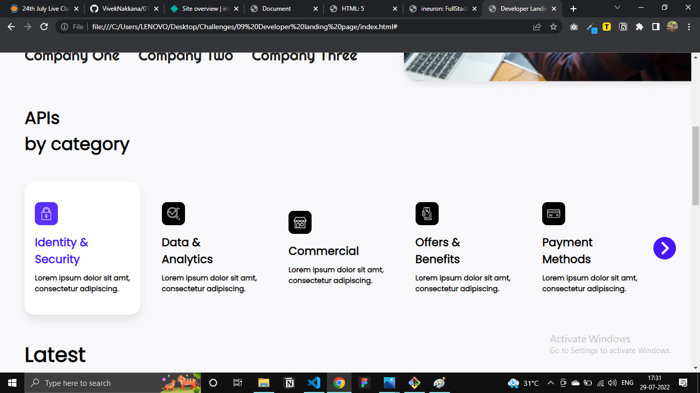
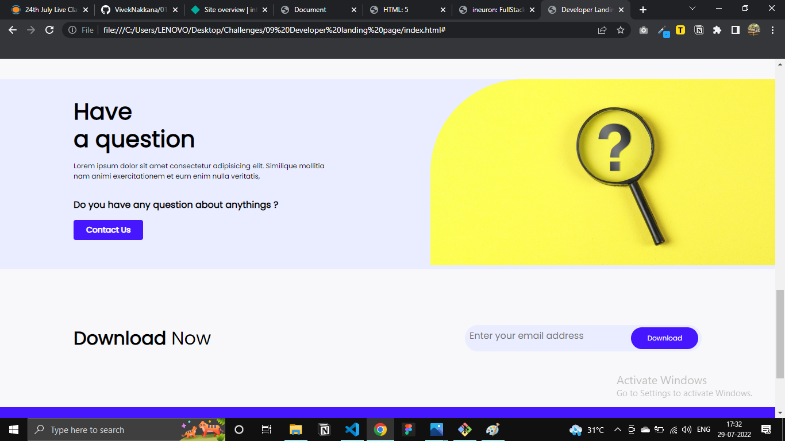

## DEVELOPER LANDING PAGE

>THIS WEBSITE IS NOT RESPONSIVE AT PRESENT -- PLEASE OPEN IN DESKTOP

### While building this project, I learnt:
- How to structure the HTML according to requirements.
- Aligning items in flexbox
- Dealing with images in cards

### Time spent: 6 hours

### [Live Website]()

#### Quick Look Of how website looks:

